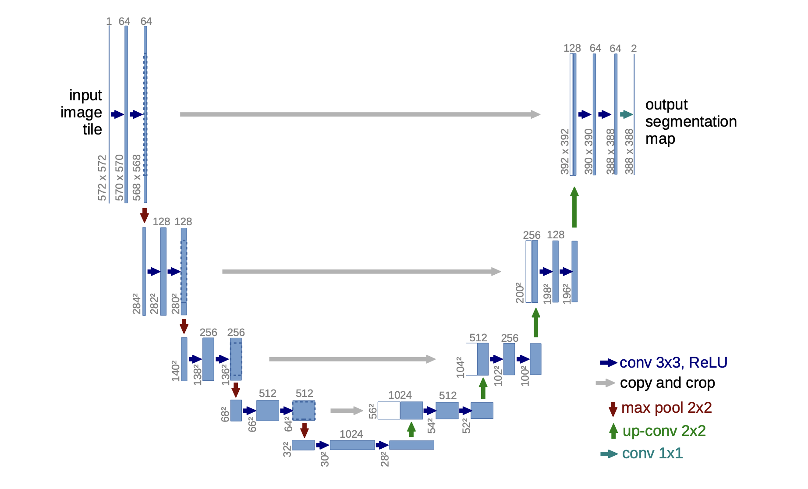

# AutoMaskAI: Real-Time Vehicle Segmentation Pipeline

<div align="center">
    <a href="https://pytorch.org/">
        
    </a>
    <a href="https://www.kaggle.com/c/carvana-image-masking-challenge">
        
    </a>
</div>

<br/>
<div align="center">
    <p>⭐ Star this repository if you find it helpful!</p>
</div>

<p align="center">
  
</p>

A complete implementation of U-Net architecture for semantic image segmentation using PyTorch. This project focuses on real-time vehicle segmentation, specifically identifying car boundaries in high-resolution images using the Carvana Image Masking Challenge dataset.

## Overview

U-Net is a convolutional neural network architecture originally designed for biomedical image segmentation. This implementation adapts the model for automotive image segmentation, achieving high-precision pixel-level classification for vehicle detection and masking.

### Key Features

- **Modular Architecture**: Clean separation of encoder, decoder, and utility components
- **Skip Connections**: Preserves fine-grained spatial information through concatenation
- **Real-time Processing**: Optimized for fast inference on vehicle images
- **Configurable Training**: Adjustable hyperparameters and data paths
- **Dual Inference Modes**: Single image and batch processing capabilities
- **Pre-trained Weights**: Ready-to-use model for immediate inference

## Table of Contents
* [Architecture Implementation](#architecture-implementation)
    * [UNet](#unet)
    * [DoubleConv](#doubleconv)
    * [DownSample](#downsample)
    * [UpSample](#upsample)
* [Installation](#installation)
* [Usage](#usage)
    * [Project Structure](#project-structure)
    * [Training](#training)
    * [Inference](#inference)
* [Model Configuration](#model-configuration)
* [Performance](#performance)
* [Customization](#customization)
* [Troubleshooting](#troubleshooting)
* [Contributing](#contributing)
* [Contact](#contact)

## Architecture Implementation

We need four classes to implement U-Net. Parts of the `UNet` class which are `DownSample` to apply down sampling operation, `UpSample` to apply up sampling operation, `DoubleConv` to apply double convolution operation and the `UNet` as the main U-Net class.

### Network Flow

```
Input (3 channels) → Encoder (4 levels) → Bottleneck (1024 features) → Decoder (4 levels) → Output (num_classes)
                     ↓                                                    ↑
                Skip Connections ──────────────────────────────────────────
```

### UNet

```python
class UNet(nn.Module):
    def __init__(self, in_channels, num_classes):
        super().__init__()
        self.down_convolution_1 = DownSample(in_channels, 64)
        self.down_convolution_2 = DownSample(64, 128)
        self.down_convolution_3 = DownSample(128, 256)
        self.down_convolution_4 = DownSample(256, 512)

        self.bottle_neck = DoubleConv(512, 1024)

        self.up_convolution_1 = UpSample(1024, 512)
        self.up_convolution_2 = UpSample(512, 256)
        self.up_convolution_3 = UpSample(256, 128)
        self.up_convolution_4 = UpSample(128, 64)

        self.out = nn.Conv2d(in_channels=64, out_channels=num_classes, kernel_size=1)

    def forward(self, x):
       down_1, p1 = self.down_convolution_1(x)
       down_2, p2 = self.down_convolution_2(p1)
       down_3, p3 = self.down_convolution_3(p2)
       down_4, p4 = self.down_convolution_4(p3)

       b = self.bottle_neck(p4)

       up_1 = self.up_convolution_1(b, down_4)
       up_2 = self.up_convolution_2(up_1, down_3)
       up_3 = self.up_convolution_3(up_2, down_2)
       up_4 = self.up_convolution_4(up_3, down_1)

       out = self.out(up_4)
       return out
```

### DoubleConv

```python
class DoubleConv(nn.Module):
    def __init__(self, in_channels, out_channels):
        super().__init__()
        self.conv_op = nn.Sequential(
            nn.Conv2d(in_channels, out_channels, kernel_size=3, padding=1),
            nn.ReLU(inplace=True),
            nn.Conv2d(out_channels, out_channels, kernel_size=3, padding=1),
            nn.ReLU(inplace=True)
        )

    def forward(self, x):
        return self.conv_op(x)
```

### DownSample

```python
class DownSample(nn.Module):
    def __init__(self, in_channels, out_channels):
        super().__init__()
        self.conv = DoubleConv(in_channels, out_channels)
        self.pool = nn.MaxPool2d(kernel_size=2, stride=2)

    def forward(self, x):
        down = self.conv(x)
        p = self.pool(down)

        return down, p
```

### UpSample
```python
class UpSample(nn.Module):
    def __init__(self, in_channels, out_channels):
        super().__init__()
        self.up = nn.ConvTranspose2d(in_channels, in_channels//2, kernel_size=2, stride=2)
        self.conv = DoubleConv(in_channels, out_channels)

    def forward(self, x1, x2):
       x1 = self.up(x1)
       x = torch.cat([x1, x2], 1)
       return self.conv(x)
```

## Installation

### Prerequisites

- Python 3.7+
- PyTorch 1.7+
- torchvision
- PIL (Pillow)
- numpy
- matplotlib (for visualization)

### Setup

1. Clone the repository:
```bash
git clone https://github.com/Vkartik-3/AutoMaskAI-Real-Time-Vehicle-Segmentation-Pipeline.git
cd AutoMaskAI-Real-Time-Vehicle-Segmentation-Pipeline
```

2. Install dependencies:
```bash
pip install torch torchvision pillow numpy matplotlib
```

3. Download the Carvana dataset:
   - Visit [Carvana Image Masking Challenge](https://www.kaggle.com/c/carvana-image-masking-challenge)
   - Download training images and masks
   - Extract to `src/data/train/` and `src/data/train_mask/` respectively

## Usage

### Project Structure

Project structured as follows:

```
src/
├── carvana_dataset.py     # PyTorch dataset class for Carvana data
├── unet.py                # Main U-Net architecture
├── unet_parts.py          # Building blocks (DoubleConv, DownSample, UpSample)
├── main.py                # Training loop with configurable parameters
├── inference.py           # Single and batch inference functions
├── data/
│   ├── manual_test        # Optional test images
│   ├── manual_test_mask   # Optional test masks
│   ├── train              # Training images
│   └── train_mask         # Training masks
└── models/                # Saved model checkpoints
```

`carvana_dataset.py` creates the PyTorch dataset. `unet_parts.py` contains the building blocks for the U-Net. `unet.py` is the file that contains the U-Net architecture. `main.py` file contains the training loop. `inference.py` contains necessary functions to easily run inference for single and multiple images.

`models/` directory is to save and store the trained models.

`data/` directory contains the data you're going to train on. `train/` contains images and `train_mask/` contains masks for the images. `manual_test/` and `manual_test_mask/` are optional directories for showcasing the inference.

### Pre-Trained Model

You can download a sample pre-trained model from [here](https://drive.google.com/file/d/1evei4cZkBlpoq70iapItN1ojldIXSOc2/view?usp=sharing). Put the model into the `models/` directory.

### Training

In order to train the model you must run the command `python main.py`. File has hyperparameters of `LEARNING_RATE`, `BATCH_SIZE` and `EPOCHS`. You can change them as you like.

You must give your data directory and the directory you want to save your model to `DATA_PATH` and `MODEL_SAVE_PATH` variables in the `main.py` file.

#### Configuration Example:
```python
LEARNING_RATE = 1e-4
BATCH_SIZE = 16
EPOCHS = 100
DATA_PATH = "data/"
MODEL_SAVE_PATH = "models/unet_model.pth"
```

#### Start Training:
```bash
cd src
python main.py
```

By the end of the training your model will be saved into the `MODEL_SAVE_PATH`.

### Inference

`inference.py` file provides two functions for inference. If you want to run prediction on multiple images, you must use `pred_show_image_grid()` function by giving your data path, model path and device as arguments.

If you want to run the prediction on single image, you must use `single_image_inference()` function by giving image path, model path and your device as arguments.

#### Single Image Prediction

```python
from inference import single_image_inference

# Predict on a single image
result = single_image_inference(
    image_path="path/to/image.jpg",
    model_path="models/unet_model.pth",
    device="cuda"  # or "cpu"
)
```

#### Batch Prediction

```python
from inference import pred_show_image_grid

# Process multiple images with visualization
pred_show_image_grid(
    data_path="data/manual_test/",
    model_path="models/unet_model.pth",
    device="cuda"
)
```

You can view a sample use inside `inference.py`.

## Model Configuration

### Hyperparameters

| Parameter | Default | Description |
|-----------|---------|-------------|
| Learning Rate | 1e-4 | Adam optimizer learning rate |
| Batch Size | 16 | Number of samples per batch |
| Epochs | 100 | Training iterations |
| Input Channels | 3 | RGB image channels |
| Output Classes | 2 | Background and car classes |

### Architecture Details

| Component | Input Channels | Output Channels | Operations |
|-----------|----------------|-----------------|------------|
| Encoder 1 | 3 | 64 | DoubleConv + MaxPool |
| Encoder 2 | 64 | 128 | DoubleConv + MaxPool |
| Encoder 3 | 128 | 256 | DoubleConv + MaxPool |
| Encoder 4 | 256 | 512 | DoubleConv + MaxPool |
| Bottleneck | 512 | 1024 | DoubleConv |
| Decoder 1 | 1024+512 | 512 | ConvTranspose + DoubleConv |
| Decoder 2 | 512+256 | 256 | ConvTranspose + DoubleConv |
| Decoder 3 | 256+128 | 128 | ConvTranspose + DoubleConv |
| Decoder 4 | 128+64 | 64 | ConvTranspose + DoubleConv |
| Output | 64 | num_classes | 1x1 Conv |

## Performance

### Expected Results

- **Dataset**: Carvana Image Masking Challenge
- **Input Resolution**: 1024x1024 pixels
- **Target Metric**: Pixel-wise accuracy and IoU score
- **Training Time**: ~2-4 hours on modern GPU
- **Inference Speed**: <100ms per image on GPU

### Evaluation Metrics

The model performance can be evaluated using:
- Pixel accuracy
- Intersection over Union (IoU)
- Dice coefficient
- Precision and Recall

## Customization

### Using Your Own Dataset

1. Modify `carvana_dataset.py` to load your data format
2. Adjust `num_classes` in the UNet initialization
3. Update data paths in `main.py`

### Architecture Modifications

- **Change depth**: Modify the number of encoder/decoder layers
- **Adjust channels**: Alter the channel progression in each layer
- **Add regularization**: Include dropout or batch normalization

## Troubleshooting

### Common Issues

**CUDA out of memory**: Reduce batch size in `main.py`
```python
BATCH_SIZE = 8  # Reduce from 16
```

**Low performance**: Ensure proper data preprocessing and augmentation
```python
# Add data augmentation in carvana_dataset.py
transforms.Compose([
    transforms.RandomHorizontalFlip(),
    transforms.RandomRotation(10),
    transforms.ToTensor()
])
```

**Slow training**: Use mixed precision training
```python
# Add to training loop
from torch.cuda.amp import autocast, GradScaler
scaler = GradScaler()
```

## Contributing

1. Fork the repository
2. Create a feature branch: `git checkout -b feature-name`
3. Commit changes: `git commit -am 'Add feature'`
4. Push to branch: `git push origin feature-name`
5. Submit a pull request

## Contact

For questions, suggestions, or collaboration opportunities, please feel free to reach out:

- **GitHub**: [@Vkartik-3](https://github.com/Vkartik-3)
- **Project Repository**: [AutoMaskAI](https://github.com/Vkartik-3/AutoMaskAI-Real-Time-Vehicle-Segmentation-Pipeline)

## References

- [U-Net: Convolutional Networks for Biomedical Image Segmentation](https://arxiv.org/abs/1505.04597)
- [Carvana Image Masking Challenge](https://www.kaggle.com/c/carvana-image-masking-challenge)
- [PyTorch Documentation](https://pytorch.org/docs/)

## License

This project is licensed under the MIT License - see the LICENSE file for details.

## Acknowledgments

- Original U-Net paper by Ronneberger et al.
- Carvana dataset provided by Kaggle
- PyTorch team for the deep learning framework
- Original implementation inspiration from the open-source community
